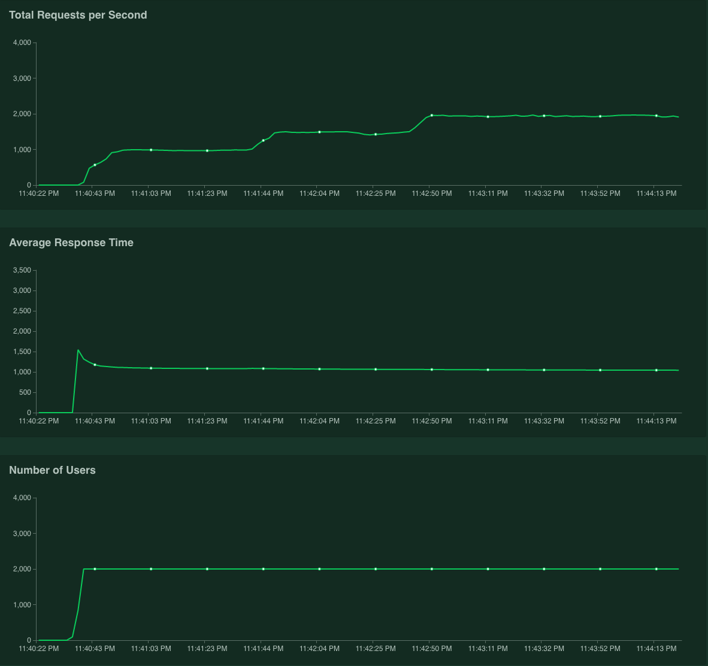
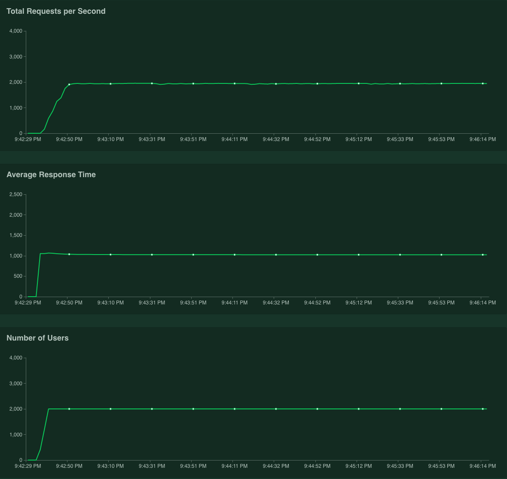

Goal
---

This project verifies AWS Lambda auto-scaling behavior.
<br/>
<br/>
AWS is describing about Lambda auto-scaling like below.

> Automatic Scaling
AWS Lambda will dynamically scale capacity in response to increased traffic, subject to your account's Account Level Concurrent Execution Limit. To handle bursts in traffic, Lambda automatically increases a function's capacity when it is under load.
If the default Immediate Concurrency Increase value is not sufficient to accommodate the traffic surge, AWS Lambda will continue to increase the number of concurrent function executions by 500 per minute until your account safety limit has been reached or the number of concurrently executing functions is sufficient to successfully process the increased load.

Reference [here](https://docs.aws.amazon.com/lambda/latest/dg/scaling.html)


Test Method & Environment
---

#### 1. Dependency
- [serverless-framwork](https://serverless.com/)
    - Deploy Lambda + API-gateway
- [locust](https://locust.io)
    - Generate traffic
<br/>

#### 2. Test Lambda Function & Locustfile
```pythonn
# lambda_function.py
import time

def handler(event, context):
    print('Lambda auto-sacaling test')
    time.sleep(1)
```
- Lambda average duration will be about 1 sec for a request.
<br/>

```
# locustfile.py
from locust import TaskSet, HttpLocust, task

class TestTaskSet(TaskSet):

    @task
    def fire(self):
        print('Fire!!')
        self.client.get('/test/fire')


class TestHttpLocust(HttpLocust):
    task_set = TestTaskSet
    min_wait = 1
    max_wait = 1

```
- Locust keeps transmiting requests with almost no interval(1 ms) just after receiving response.
<br/>


#### 3. Lambda Concurrency Value

| Concurrency limit |Immediate Concurrency Increase|
|-------------------|------------------------------|
| 2000              | 1000                          |

- The value would be difference by AWS account region.
<br/>

#### 4. Load Generator
- EC2 `c5.9xlarge` instance
- Locust distributed with 36 slaves. (use [locust-distributed-swarm](https://github.com/asleea88/locust-distributed-swarm))
<br/>


Test Result
---



As AWS describ, Lambda is throttled when it reaches `Immediate Concurrency`(1000) fisrt time.
After that, it keeps increasing concurrent function executions by 500 per minute until `concurrency limit`(2000).


In addition, You can see `cold-start` effect in `Average Response Time` chart.
(At the first peak, 1.5 sec response time against following 1 sec)

<br/>



After auto-scaling, The scaled capacity(2000) is retained for a while.
As the result, second time test shows different shap of chart. It keeps increasing without any throttling until concurrency limit(2000) and there is no `cold-start` time as well.
